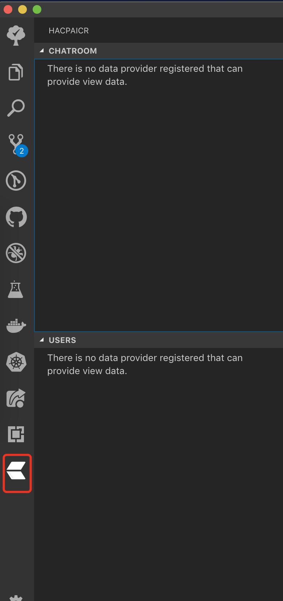
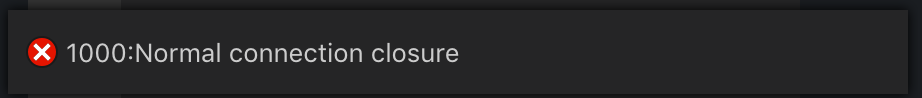

# How to use

use `ctrl + shift + p` to show the command's input box  

## First Sign

input your username and password

open the chatroom

## Second Connect

input `connect` to connect to the server

and then your chatroom will be this

## Third Send Message

input send to send an message

## Error

if you can see this error

then you must signout and signin again

# Thanks List

| | | 
| --- | --- |
| | | 
|| |

# LICENSE

MIT